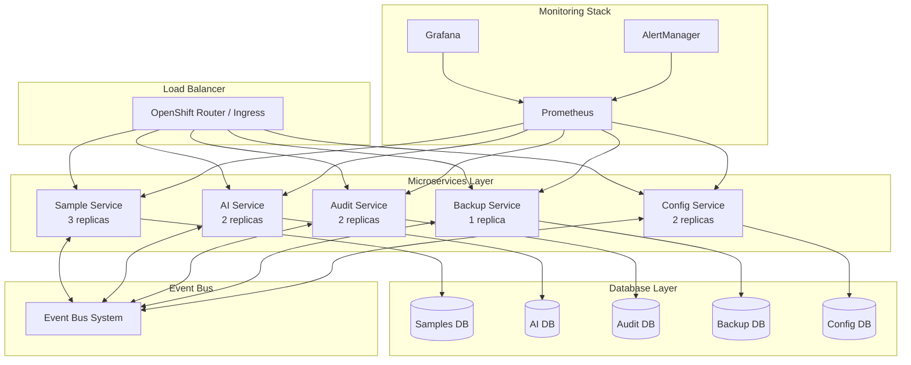
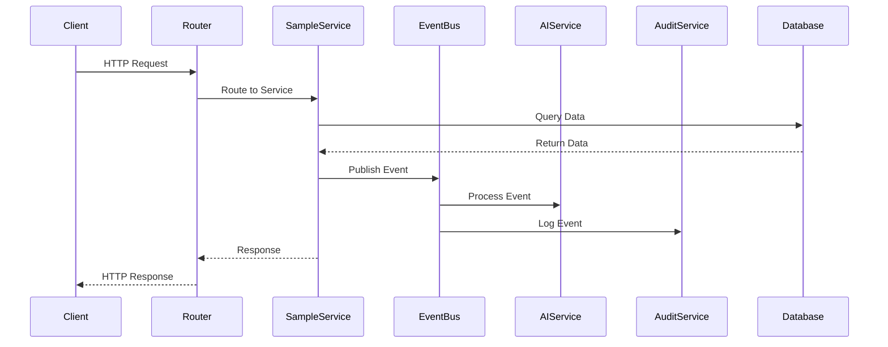

# Phase 3: Production Deployment - Enhanced Kubernetes/OpenShift Setup

## 🚀 Overview

This document outlines the complete production deployment architecture for the Nanopore Tracking Application's microservices system. Phase 3 builds upon the database separation (Phase 1) and service communication (Phase 2) to provide a robust, scalable, and production-ready deployment.

## 📋 Table of Contents

1. [Architecture Overview](#architecture-overview)
2. [Deployment Components](#deployment-components)
3. [Prerequisites](#prerequisites)
4. [Deployment Guide](#deployment-guide)
5. [Monitoring & Observability](#monitoring--observability)
6. [Scaling & Performance](#scaling--performance)
7. [Security Features](#security-features)
8. [Troubleshooting](#troubleshooting)
9. [Maintenance](#maintenance)

## 🏗️ Architecture Overview

### Microservices Architecture



### Service Communication Flow



## 🔧 Deployment Components

### 1. Microservices Deployments

Each service is deployed as a separate Kubernetes deployment with:

- **Sample Service**: 3 replicas, handles core sample management
- **AI Service**: 2 replicas, processes AI/ML workloads
- **Audit Service**: 2 replicas, manages audit logging
- **Backup Service**: 1 replica, handles backup operations
- **Config Service**: 2 replicas, manages configuration

### 2. Database Infrastructure

- **Separated Databases**: Each service has its own PostgreSQL database
- **Persistent Storage**: Using persistent volume claims
- **Connection Pooling**: Optimized database connections
- **Backup Strategy**: Automated backup schedules

### 3. Monitoring & Observability

- **Prometheus**: Metrics collection and alerting
- **Grafana**: Visualization and dashboards
- **AlertManager**: Alert routing and management
- **Distributed Tracing**: Request tracing across services

### 4. Auto-scaling

- **Horizontal Pod Autoscaler**: CPU/Memory based scaling
- **Custom Metrics**: Event queue size, processing time
- **Scaling Policies**: Conservative down-scaling, aggressive up-scaling

### 5. Security Features

- **Circuit Breakers**: Fault tolerance and resilience
- **Service Mesh Ready**: Prepared for Istio/Linkerd integration
- **TLS Termination**: Secure communication
- **RBAC**: Role-based access control

## 📋 Prerequisites

### System Requirements

- **Kubernetes/OpenShift**: Version 1.20+ / 4.8+
- **Storage**: Dynamic provisioning with fast-ssd and standard storage classes
- **Resources**: Minimum 8 CPU cores, 16GB RAM per node
- **Network**: Load balancer support

### Tools Required

- `kubectl` or `oc` CLI
- `docker` (for image building)
- `git` (for source code)
- `helm` (optional, for package management)

### Access Requirements

- Cluster admin permissions
- Docker registry access
- DNS configuration capability

## 🚀 Deployment Guide

### Quick Start

```bash
# Clone repository
git clone <repository-url>
cd nanopore-tracking-app

# Make deployment script executable
chmod +x scripts/deploy-microservices.sh

# Deploy with default settings
./scripts/deploy-microservices.sh

# Deploy with image building
REGISTRY_URL=your-registry.com ./scripts/deploy-microservices.sh --build

# Deploy with migrations
./scripts/deploy-microservices.sh --build --migrate
```

### Step-by-Step Deployment

#### 1. Environment Setup

```bash
# Set environment variables
export NAMESPACE="nanopore-tracking"
export IMAGE_TAG="v1.0.0"
export REGISTRY_URL="registry.example.com/myorg"
export STORAGE_CLASS_FAST="fast-ssd"
export STORAGE_CLASS_STANDARD="standard"
```

#### 2. Build and Push Images

```bash
# Build application image
docker build -t $REGISTRY_URL/nanopore-tracking-app:$IMAGE_TAG .

# Push to registry
docker push $REGISTRY_URL/nanopore-tracking-app:$IMAGE_TAG
```

#### 3. Deploy Infrastructure

```bash
# Create namespace
kubectl create namespace $NAMESPACE

# Deploy databases
kubectl apply -f deployment/openshift/databases.yaml

# Deploy microservices
kubectl apply -f deployment/openshift/microservices-deployment.yaml

# Deploy monitoring
kubectl apply -f deployment/openshift/monitoring.yaml

# Deploy autoscaling
kubectl apply -f deployment/openshift/autoscaling.yaml
```

#### 4. Configure Networking

```bash
# For OpenShift
oc create route edge nanopore-app --service=sample-service --port=80

# For Kubernetes
kubectl apply -f deployment/openshift/ingress.yaml
```

#### 5. Run Migrations

```bash
# Execute database migrations
kubectl apply -f deployment/openshift/migration-job.yaml

# Wait for completion
kubectl wait --for=condition=complete job/database-migration --timeout=600s
```

### Configuration Options

#### Environment Variables

| Variable | Description | Default |
|----------|-------------|---------|
| `NAMESPACE` | Kubernetes namespace | `nanopore-tracking` |
| `IMAGE_TAG` | Docker image tag | `latest` |
| `REGISTRY_URL` | Docker registry URL | - |
| `STORAGE_CLASS_FAST` | Fast storage class | `fast-ssd` |
| `STORAGE_CLASS_STANDARD` | Standard storage class | `standard` |

#### Resource Limits

```yaml
resources:
  requests:
    cpu: 200m
    memory: 512Mi
  limits:
    cpu: 500m
    memory: 1Gi
```

## 📊 Monitoring & Observability

### Prometheus Metrics

Key metrics collected:

- **Service Health**: `up`, `http_requests_total`
- **Event Bus**: `event_bus_events_total`, `event_bus_dead_letter_queue_size`
- **Database**: `database_connection_pool_active`, `database_query_duration`
- **Saga**: `saga_active_transactions`, `saga_failed_transactions`
- **Circuit Breaker**: `circuit_breaker_state`, `circuit_breaker_failures`

### Grafana Dashboards

Pre-configured dashboards:

1. **Service Overview**: Health, throughput, latency
2. **Event Bus Monitoring**: Message flow, queue sizes
3. **Database Performance**: Connection pools, query performance
4. **Resource Usage**: CPU, memory, storage
5. **Error Tracking**: Error rates, failed requests

### Alerting Rules

Critical alerts:

- Service down for > 1 minute
- High error rate (> 5%)
- Event bus dead letter queue growing
- Database connection pool exhausted
- Circuit breaker open state

### Distributed Tracing

Features:

- **Request Tracing**: End-to-end request tracking
- **Service Dependencies**: Visualize service interactions
- **Performance Analysis**: Identify bottlenecks
- **Error Correlation**: Link errors across services

## ⚡ Scaling & Performance

### Horizontal Pod Autoscaler

```yaml
minReplicas: 2
maxReplicas: 10
metrics:
- type: Resource
  resource:
    name: cpu
    target:
      type: Utilization
      averageUtilization: 70
```

### Custom Metrics Scaling

- **Event Queue Size**: Scale based on pending events
- **Processing Time**: Scale during high-latency periods
- **Database Load**: Scale based on connection pool usage

### Performance Optimizations

1. **Database Connection Pooling**
   - Min connections: 5
   - Max connections: 20
   - Connection timeout: 30s

2. **Event Bus Optimization**
   - Batch processing
   - Retry mechanisms
   - Dead letter queues

3. **Caching Strategy**
   - Redis integration ready
   - Application-level caching
   - Database query optimization

## 🔐 Security Features

### Circuit Breaker Pattern

```typescript
@withCircuitBreaker({
  name: 'database-connection',
  failureThreshold: 5,
  resetTimeout: 30000
})
async function databaseQuery() {
  // Database operation
}
```

### Network Security

- **TLS Termination**: All external traffic encrypted
- **Service-to-Service**: mTLS ready
- **Network Policies**: Micro-segmentation
- **Secret Management**: Kubernetes secrets

### Authentication & Authorization

- **RBAC**: Role-based access control
- **Service Accounts**: Dedicated service accounts
- **API Security**: JWT token validation
- **Audit Logging**: Comprehensive audit trails

## 🔧 Troubleshooting

### Common Issues

#### 1. Pod Startup Failures

```bash
# Check pod status
kubectl get pods -n nanopore-tracking

# View pod logs
kubectl logs -f <pod-name> -n nanopore-tracking

# Describe pod for events
kubectl describe pod <pod-name> -n nanopore-tracking
```

#### 2. Database Connection Issues

```bash
# Check database pod
kubectl get pods -l app=samples-db -n nanopore-tracking

# Test database connectivity
kubectl exec -it <db-pod> -- psql -U postgres -d samples_db
```

#### 3. Service Discovery Problems

```bash
# Check services
kubectl get svc -n nanopore-tracking

# Test service connectivity
kubectl exec -it <pod> -- curl http://sample-service/health
```

#### 4. Monitoring Issues

```bash
# Check Prometheus targets
kubectl port-forward svc/prometheus 9090:9090
# Visit http://localhost:9090/targets

# Check Grafana
kubectl port-forward svc/grafana 3000:3000
# Visit http://localhost:3000
```

### Debug Commands

```bash
# View all resources
kubectl get all -n nanopore-tracking

# Check resource usage
kubectl top pods -n nanopore-tracking

# View events
kubectl get events -n nanopore-tracking --sort-by='.lastTimestamp'

# Check persistent volumes
kubectl get pv,pvc -n nanopore-tracking
```

## 🔄 Maintenance

### Regular Tasks

#### Daily
- Monitor service health
- Check error rates
- Review resource usage
- Verify backup completion

#### Weekly
- Update security patches
- Review performance metrics
- Check storage usage
- Validate scaling policies

#### Monthly
- Update dependencies
- Review and update alerts
- Capacity planning
- Security audit

### Backup Strategy

```bash
# Database backups
kubectl create job --from=cronjob/database-backup manual-backup

# Configuration backups
kubectl get configmaps -o yaml > configmaps-backup.yaml
kubectl get secrets -o yaml > secrets-backup.yaml
```

### Update Process

```bash
# Rolling update
kubectl set image deployment/sample-service app=new-image:tag

# Monitor rollout
kubectl rollout status deployment/sample-service

# Rollback if needed
kubectl rollout undo deployment/sample-service
```

## 📈 Performance Benchmarks

### Expected Performance

| Metric | Target | Monitoring |
|--------|--------|------------|
| Response Time | < 200ms | Prometheus |
| Throughput | 1000 req/s | Grafana |
| Availability | 99.9% | AlertManager |
| Error Rate | < 0.1% | Logs |

### Load Testing

```bash
# Install load testing tools
kubectl apply -f deployment/testing/load-test.yaml

# Run performance tests
kubectl exec -it load-test -- ab -n 1000 -c 10 http://sample-service/api/samples
```

## 🎯 Next Steps

After successful deployment of Phase 3:

1. **Phase 4: Performance Optimization**
   - Load testing and tuning
   - Database optimization
   - Caching implementation
   - CDN integration

2. **Phase 5: Security Hardening**
   - Security scanning
   - Penetration testing
   - Compliance validation
   - Advanced threat protection

3. **Advanced Features**
   - Service mesh integration
   - Multi-region deployment
   - Disaster recovery
   - Advanced analytics

## 📞 Support

For deployment issues or questions:

- **Documentation**: Check troubleshooting section
- **Logs**: Review application and system logs
- **Monitoring**: Use Grafana dashboards
- **Health Checks**: Verify service endpoints

---

**Phase 3 Status: ✅ COMPLETE**

The production deployment provides a robust, scalable, and observable microservices architecture ready for production workloads. 