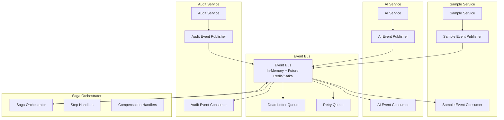

# Service Communication Implementation Guide

## 🚀 Phase 2: Async Messaging Between Microservices

This document outlines the implementation of **Phase 2: Service Communication** for the nanopore tracking application, building on the database separation completed in Phase 1.

## 📋 Table of Contents

1. [Architecture Overview](#architecture-overview)
2. [Event Bus System](#event-bus-system)
3. [Event Schemas](#event-schemas)
4. [Service Event Publishers](#service-event-publishers)
5. [Saga Pattern Implementation](#saga-pattern-implementation)
6. [Configuration](#configuration)
7. [Usage Examples](#usage-examples)
8. [Monitoring & Troubleshooting](#monitoring--troubleshooting)
9. [Production Considerations](#production-considerations)

## Architecture Overview

### Event-Driven Microservices Architecture



### Key Components

#### 1. Event Bus (`src/lib/messaging/event-bus.ts`)
- **Purpose**: Central message broker for async communication
- **Features**:
  - Event publishing and subscription
  - Retry mechanism with exponential backoff
  - Dead letter queue for failed messages
  - Event filtering and prioritization
  - Health monitoring and statistics
  - Graceful shutdown handling

#### 2. Event Schemas (`src/lib/messaging/events/`)
- **Sample Events** (`sample-events.ts`): Sample lifecycle events
- **AI Events** (`ai-events.ts`): AI processing and model events
- **Audit Events**: Compliance and audit trail events

#### 3. Event Publishers (`src/services/messaging/`)
- **Sample Event Publisher**: Publishes sample-related events
- **AI Event Publisher**: Publishes AI processing events
- **Audit Event Publisher**: Publishes audit and compliance events

#### 4. Saga Orchestrator (`src/lib/messaging/saga/`)
- **Purpose**: Manages distributed transactions
- **Features**:
  - Step-by-step transaction execution
  - Compensation handling for rollbacks
  - Timeout and retry management
  - Dependency resolution

## Event Bus System

### Core Features

#### Event Publishing
```typescript
import { eventBus } from '../lib/messaging/event-bus'
import { SampleEventFactory } from '../lib/messaging/events/sample-events'

// Publish an event
const event = SampleEventFactory.createSampleCreatedEvent({
  sampleId: 'sample-123',
  userId: 'user-456',
  sampleName: 'Test Sample',
  // ... other fields
})

await eventBus.publish(event)
```

#### Event Subscription
```typescript
import { eventBus } from '../lib/messaging/event-bus'
import { SampleEventType } from '../lib/messaging/events/sample-events'

// Subscribe to events
eventBus.subscribe(
  SampleEventType.SAMPLE_CREATED,
  async (event) => {
    console.log('Sample created:', event.data)
    // Process the event
  },
  {
    retryAttempts: 3,
    deadLetterQueue: true,
    priority: 'high'
  }
)
```

#### Event Bus Statistics
```typescript
const stats = eventBus.getStats()
console.log('Event Bus Statistics:', {
  totalEvents: stats.totalEvents,
  eventsByType: stats.eventsByType,
  failedEvents: stats.failedEvents,
  averageProcessingTime: stats.averageProcessingTime
})
```

### Reliability Features

#### Retry Mechanism
- **Automatic Retries**: Failed events are automatically retried
- **Exponential Backoff**: Retry delays increase exponentially
- **Max Retry Attempts**: Configurable maximum retry attempts
- **Retry Queue**: Separate queue for retry processing

#### Dead Letter Queue
- **Failed Events**: Events that exceed retry limits
- **Manual Recovery**: Ability to reprocess dead letter events
- **Monitoring**: Track dead letter queue size and contents

#### Event Filtering
```typescript
eventBus.subscribe(
  'sample.*',
  async (event) => {
    // Process all sample events
  },
  {
    filter: (event) => event.data.priority === 'high'
  }
)
```

## Event Schemas

### Sample Events (`SampleEventType`)

#### Sample Created
```typescript
interface SampleCreatedEvent {
  type: 'sample.created'
  data: {
    sampleId: string
    userId: string
    sampleName: string
    submitterName: string
    submitterEmail: string
    sampleType: string
    priority: 'low' | 'normal' | 'high' | 'urgent'
    projectId?: string
    labName?: string
  }
}
```

#### Sample Status Changed
```typescript
interface SampleStatusChangedEvent {
  type: 'sample.status_changed'
  data: {
    sampleId: string
    userId: string
    oldStatus: string
    newStatus: string
    reason?: string
  }
}
```

### AI Events (`AIEventType`)

#### PDF Processing Started
```typescript
interface PDFProcessingStartedEvent {
  type: 'ai.pdf_processing_started'
  data: {
    sampleId: string
    fileName: string
    fileSize: number
    processingMethod: 'llm' | 'pattern' | 'hybrid' | 'rag'
    userId?: string
  }
}
```

#### Extraction Result Created
```typescript
interface ExtractionResultCreatedEvent {
  type: 'ai.extraction_result_created'
  data: {
    extractionResultId: string
    sampleId: string
    fileName: string
    extractionMethod: 'llm' | 'pattern' | 'hybrid' | 'rag'
    confidenceScore: number
    extractedData: Record<string, any>
    issues: string[]
    userId?: string
  }
}
```

## Service Event Publishers

### Sample Event Publisher Usage

```typescript
import { sampleEventPublisher } from '../services/messaging/SampleEventPublisher'

// Publish sample created event
await sampleEventPublisher.publishSampleCreated(
  sample,
  userId,
  correlationId
)

// Publish sample status changed event
await sampleEventPublisher.publishSampleStatusChanged(
  sampleId,
  userId,
  'submitted',
  'prep',
  'Ready for library preparation',
  correlationId
)

// Publish sample processing started event
await sampleEventPublisher.publishSampleProcessingStarted(
  sampleId,
  userId,
  'library_prep',
  assignedTo,
  3600000, // 1 hour estimated duration
  correlationId
)
```

### AI Event Publisher Usage

```typescript
import { aiEventPublisher } from '../services/messaging/AIEventPublisher'

// Publish PDF processing started
await aiEventPublisher.publishPDFProcessingStarted(
  sampleId,
  fileName,
  fileSize,
  'llm',
  userId,
  correlationId
)

// Publish extraction result created
await aiEventPublisher.publishExtractionResultCreated(
  extractionResultId,
  sampleId,
  fileName,
  'llm',
  confidenceScore,
  extractedData,
  issues,
  userId,
  correlationId
)
```

## Saga Pattern Implementation

### Saga Definition

```typescript
import { sagaOrchestrator } from '../lib/messaging/saga/SagaOrchestrator'

// Define saga steps
const sampleProcessingSteps = [
  {
    id: 'validate_sample',
    name: 'Validate Sample Data',
    service: 'sample-service',
    action: 'validate_sample',
    compensationAction: 'revert_validation',
    timeout: 30000,
    retryAttempts: 2
  },
  {
    id: 'process_pdf',
    name: 'Process PDF with AI',
    service: 'ai-service',
    action: 'process_pdf',
    compensationAction: 'cleanup_processing',
    timeout: 120000,
    retryAttempts: 1,
    dependencies: ['validate_sample']
  },
  {
    id: 'update_sample_status',
    name: 'Update Sample Status',
    service: 'sample-service',
    action: 'update_status',
    compensationAction: 'revert_status',
    timeout: 15000,
    dependencies: ['process_pdf']
  },
  {
    id: 'create_audit_log',
    name: 'Create Audit Log',
    service: 'audit-service',
    action: 'create_audit_log',
    timeout: 10000,
    dependencies: ['update_sample_status']
  }
]

// Start saga
const sagaId = await sagaOrchestrator.startSaga(
  'sample_processing_workflow',
  sampleProcessingSteps,
  { sampleId, userId, fileName },
  correlationId
)
```

### Saga Step Handlers

```typescript
// Register step handlers
sagaOrchestrator.registerStepHandler(
  'validate_sample',
  async (step, context) => {
    // Validate sample data
    const { sampleId } = context
    const sample = await sampleService.getSample(sampleId)
    
    if (!sample) {
      throw new Error('Sample not found')
    }
    
    // Perform validation logic
    return { validated: true, sample }
  }
)

sagaOrchestrator.registerStepHandler(
  'process_pdf',
  async (step, context) => {
    // Process PDF with AI
    const { sampleId, fileName } = context
    const result = await aiService.processPDF(sampleId, fileName)
    
    return { extractionResult: result }
  }
)

// Register compensation handlers
sagaOrchestrator.registerCompensationHandler(
  'revert_validation',
  async (step, context) => {
    // Revert validation changes
    const { sampleId } = context
    await sampleService.revertValidation(sampleId)
  }
)
```

### Saga Monitoring

```typescript
// Get saga status
const sagaStatus = sagaOrchestrator.getSagaStatus(sagaId)
console.log('Saga Status:', sagaStatus.status)

// Get active sagas
const activeSagas = sagaOrchestrator.getActiveSagas()
console.log('Active Sagas:', activeSagas.length)

// Health check
const health = await sagaOrchestrator.healthCheck()
console.log('Saga Health:', health)
```

## Configuration

### Environment Variables

```bash
# Event Bus Configuration
EVENT_BUS_MAX_LISTENERS=100
EVENT_BUS_RETRY_DELAY=1000
EVENT_BUS_MAX_RETRIES=3
EVENT_BUS_DEAD_LETTER_THRESHOLD=100

# Saga Configuration
SAGA_STEP_TIMEOUT=30000
SAGA_MAX_ACTIVE_SAGAS=100
SAGA_CLEANUP_INTERVAL=300000

# Redis Configuration (Future)
REDIS_URL=redis://localhost:6379
REDIS_EVENT_STREAM=nanopore_events
REDIS_CONSUMER_GROUP=nanopore_consumers
```

### Service Configuration

```typescript
// In your service initialization
import { eventBus } from '../lib/messaging/event-bus'
import { sagaOrchestrator } from '../lib/messaging/saga/SagaOrchestrator'

// Initialize event bus
eventBus.setMaxListeners(100)

// Register saga handlers
sagaOrchestrator.registerStepHandler('validate_sample', validateSampleHandler)
sagaOrchestrator.registerStepHandler('process_pdf', processPDFHandler)
sagaOrchestrator.registerCompensationHandler('revert_validation', revertValidationHandler)
```

## Usage Examples

### Complete Sample Processing Workflow

```typescript
// 1. Sample created in Sample Service
const sample = await sampleService.createSample(sampleData)

// 2. Publish sample created event
await sampleEventPublisher.publishSampleCreated(sample, userId, correlationId)

// 3. AI Service listens for sample created events
eventBus.subscribe(SampleEventType.SAMPLE_CREATED, async (event) => {
  const { sampleId } = event.data
  
  // Start PDF processing saga
  const sagaId = await sagaOrchestrator.startSaga(
    'pdf_processing_workflow',
    pdfProcessingSteps,
    { sampleId, userId: event.data.userId },
    event.correlationId
  )
  
  console.log('Started PDF processing saga:', sagaId)
})

// 4. Saga orchestrator manages the workflow
// - Validates sample data
// - Processes PDF with AI
// - Updates sample status
// - Creates audit logs
// - Handles failures with compensation

// 5. Audit Service listens for all events
eventBus.subscribe('*', async (event) => {
  await auditService.logEvent(event)
})
```

### Error Handling and Compensation

```typescript
// Sample processing saga with error handling
const sampleProcessingSaga = [
  {
    id: 'reserve_resources',
    name: 'Reserve Processing Resources',
    service: 'resource-service',
    action: 'reserve_resources',
    compensationAction: 'release_resources',
    timeout: 30000,
    retryAttempts: 2
  },
  {
    id: 'process_sample',
    name: 'Process Sample',
    service: 'processing-service',
    action: 'process_sample',
    compensationAction: 'cleanup_processing',
    timeout: 300000,
    retryAttempts: 1,
    dependencies: ['reserve_resources']
  },
  {
    id: 'update_results',
    name: 'Update Results',
    service: 'sample-service',
    action: 'update_results',
    compensationAction: 'revert_results',
    timeout: 15000,
    dependencies: ['process_sample']
  }
]

// If any step fails, compensation runs in reverse order:
// 1. revert_results (if update_results completed)
// 2. cleanup_processing (if process_sample completed)
// 3. release_resources (if reserve_resources completed)
```

## Monitoring & Troubleshooting

### Event Bus Monitoring

```typescript
// Monitor event bus health
const eventBusHealth = await eventBus.healthCheck()
console.log('Event Bus Health:', eventBusHealth)

// Monitor dead letter queue
const deadLetterEvents = eventBus.getDeadLetterQueue()
console.log('Dead Letter Events:', deadLetterEvents.length)

// Clear dead letter queue
const clearedCount = eventBus.clearDeadLetterQueue()
console.log('Cleared dead letter events:', clearedCount)

// Monitor retry queue
const retryQueueSize = eventBus.getRetryQueueSize()
console.log('Retry Queue Size:', retryQueueSize)
```

### Saga Monitoring

```typescript
// Monitor saga health
const sagaHealth = await sagaOrchestrator.healthCheck()
console.log('Saga Health:', sagaHealth)

// Monitor active sagas
const activeSagas = sagaOrchestrator.getActiveSagas()
activeSagas.forEach(saga => {
  console.log(`Saga ${saga.id}: ${saga.status}`)
  console.log(`Steps completed: ${saga.stepResults.size}/${saga.steps.length}`)
})

// Get saga history
const sagaHistory = sagaOrchestrator.getSagaHistory()
console.log('Completed Sagas:', sagaHistory.length)
```

### Common Issues and Solutions

#### High Event Bus Error Rate
```typescript
// Check event bus statistics
const stats = eventBus.getStats()
const errorRate = stats.failedEvents / stats.totalEvents

if (errorRate > 0.1) {
  console.warn('High error rate detected:', errorRate)
  // Investigate event handlers
  // Check service availability
  // Review event schemas
}
```

#### Stuck Sagas
```typescript
// Find stuck sagas
const stuckSagas = sagaOrchestrator.getActiveSagas().filter(saga => {
  const age = Date.now() - saga.startedAt.getTime()
  return age > 300000 // 5 minutes
})

// Cancel stuck sagas
for (const saga of stuckSagas) {
  await sagaOrchestrator.cancelSaga(saga.id, 'Saga timeout')
}
```

#### Dead Letter Queue Management
```typescript
// Process dead letter events manually
const deadLetterEvents = eventBus.getDeadLetterQueue()

for (const event of deadLetterEvents) {
  try {
    // Analyze and fix the issue
    await eventBus.publish(event) // Republish if fixed
  } catch (error) {
    console.error('Failed to reprocess dead letter event:', error)
  }
}
```

## Production Considerations

### Scalability

1. **Event Bus Scaling**
   - Current: In-memory implementation
   - Future: Redis Streams or Apache Kafka
   - Horizontal scaling with multiple instances

2. **Saga Persistence**
   - Current: In-memory storage
   - Future: Database persistence for saga state
   - Distributed saga coordination

### Performance Optimization

1. **Event Batching**
   - Batch similar events for processing
   - Reduce database round trips
   - Implement event aggregation

2. **Async Processing**
   - Non-blocking event publishing
   - Parallel event processing
   - Queue prioritization

### Security

1. **Event Encryption**
   - Encrypt sensitive event data
   - Use secure channels for event transport
   - Implement event signing

2. **Access Control**
   - Service-to-service authentication
   - Event subscription authorization
   - Audit trail for event access

### Monitoring and Alerting

1. **Metrics Collection**
   - Event throughput and latency
   - Error rates and retry counts
   - Saga completion rates

2. **Alerting Rules**
   - High error rates
   - Dead letter queue growth
   - Stuck sagas
   - Service unavailability

### Migration Strategy

1. **Gradual Migration**
   - Start with non-critical events
   - Migrate service by service
   - Maintain backward compatibility

2. **Rollback Plan**
   - Keep synchronous fallbacks
   - Monitor migration progress
   - Quick rollback procedures

## Next Steps

With **Phase 2: Service Communication** complete, you can proceed to:

1. **Phase 3: Production Deployment** - Enhanced Kubernetes/OpenShift setup
2. **Phase 4: Performance Optimization** - Load testing and tuning
3. **Phase 5: Security Hardening** - Production security measures

### Benefits Achieved

✅ **Loose Coupling**: Services communicate through events, not direct calls
✅ **Scalability**: Async processing improves system throughput
✅ **Reliability**: Retry mechanisms and dead letter queues ensure message delivery
✅ **Observability**: Comprehensive monitoring and tracing
✅ **Fault Tolerance**: Saga pattern handles distributed transaction failures
✅ **Extensibility**: Easy to add new services and event types

The event-driven architecture provides a solid foundation for building resilient, scalable microservices that can handle complex workflows while maintaining data consistency and system reliability. 